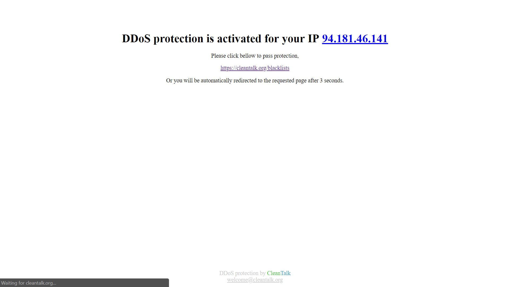

# anti-ddos-lite
A small PHP app to protect your site against DDoS attack.

## Description
Most of bots can't execute JavaScript code or can execute code partiraly. This app filters traffic from bots by using simple JavaScript code. So, bots will be denied to read original pages, they will be get only a single stop-page. As result DDoS attack will be reduced by elemenation of bots traffic that participating in the DDoS attack.

In the same time, real people will be get original page after short delay because the browser of real people can execute JavaScript code.

The real people will be see the stop-page only once, during first visit to the site.


## How to use

1. Include the app as first line in index.php.
```php
<?php
require "anti-ddos-lite/anti-ddos-lite.php";

//
// index.php code bellow
// ...
//

?>
```

2. Generate new value for $secure_cookie_salt. 
## Contacts
Email: welcome@cleantalk.org
