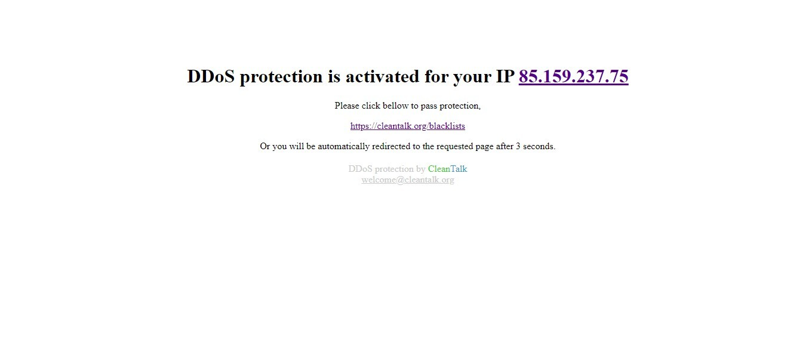

# DDoS-Protection-Lite

[](https://travis-ci.org/CleanTalk/anti-ddos-lite)

Anti-DDoS-Lite (Anti-Crawler app) is a PHP app to protect your site against DDoS attack or crawling web site by bots.

## Description
Anti-DDoS-Lite helps block bots and reduce server load and stops bad bots before they can reach your original web page. During the opening of the site page, the application performs a JS check and if the check fails, then a blocking page will be displayed.

Most of bots can't execute JavaScript code or can execute code partially. This app filters traffic from bots by using simple JavaScript code. Bots are denied to read original pages, they get only a single stop-page. As a result DDoS attack is reduced by elimination of bots traffic that participating in the DDoS attack.

In the same time, legitimate/real visitors get the original page after a short delay because the browser of legitimate/real visitors executes JavaScript code. The legitimate/real visitors see the stop-page only once, during first visit to the site.



## How to use

1. Include the app as first line in index.php by various way:

**A** Download, unzip and include the app:
```php
<?php
// This file have to be very first included
require "anti-ddos-lite/anti-ddos-lite.php";

//
// index.php code bellow
// ...
//

?>
```

**B** Or install the app by composer package:

```
composer require cleantalk/anti-ddos-lite
```
```php
<?php
// Init the app before your web app's main logic
\Cleantalk\CleantalkAntiDdosLite\CleantalkAntiDdosLite::init();
```

2. Generate new value for anti_ddos_salt. 

## Skip protection for visitors from trusted networks, Autonomous systesm (AS)
Setup [GeoIP](https://www.php.net/manual/en/book.geoip.php) and list excluded Autonomous systems in the $not_rated_as.
```
  $not_rated_as = '';
```

## Skip trusted User-Agents
Skip trusted User-Agents. Regular expressions are allowed, example is bellow.
```
  $not_rated_ua = array(
        'CleanTalk Uptime bot.+',
        'Googlebot', 
        'Bingbot',
        'Baiduspider',
        'YandexBot',
        'facebot',
        'facebookexternalhit/1.1 (+http://www.facebook.com/externalhit_uatext.php)',
        'ia_archiver'
);
```

## Changelog
Version 2.0.1
 * New. Headless mode detection.
 * Fix. Now visitors without JS will be blocked correctly.
 * Refactoring and minor fixes.


## Contacts
Email: welcome@cleantalk.org
